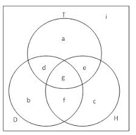

### Review for Lab 3: Braces `{}`, Brackets `[]` and Parentheses `()` in R
All MUST BE PAIRED to enclose something!

- `{}`: used in `for` and `if` to enclose the lines of codes that you want to run multiple times
- `[]`: used to get or change the values in vectors/data frames
- `()`: used in (1) functions, (2) `for` and `if`, to provide some parameters or arguments

```{r}
vec_int <- 1:10

for (i in 1:length(vec_int)) {
  if (vec_int[i] < 5) {
    print("Yes")
  } else {
    print("No")
  }
}
```

You have seen that `if` can be nested inside `for` loops. In fact `for` loops can also be nested inside `if`, or even more complicated. How they are nested depends on what you want R to do.

```{r}
vec_int <- 1:10

if (length(vec_int) < 10) {
  for (i in 1:length(vec_int)) {
    if (vec_int[i] < 5) {
      print("Yes")
    } else {
      print("No")
    }
  }
} else {
  print("Today is Tuesday!")
}
```

Thanks to the use of braces, indentation is not necessary in R (though highly recommended for improving readability of your code).

### Problem 1 (Listing all possible outcomes is feasible)

We first review some important concepts for Problem 1.

- **Sample space**: *set* of *all* possible outcomes (Sample space is a set.)
  
- **Event**: a *set* of outcomes that we can describe (An event is a **subset** of sample space)
    
- An event occurs when any one of the outcomes in the event occurs.

Example: Roll one die (this is an **experiment** / a **trial**)

- Sample space: $\Omega = \{1, 2, 3, 4, 5, 6\}$

- An event: $A = \{\text{Roll an even number}\} = \{2, 4, 6\}$

- Event $A$ occurs when you roll 2, or 4, or 6 (because you only roll a die once.)


Let's go back to Problem 1


There is a 50% chance of an expectant mother having a girl.  The Smith sisters: Anna, Mary, and Rebecca are all due at the end of the month.

  a) What is the sample space for the gender of Mary's child?
  

  
  b) What is the joint sample space for the genders of all three sisters' children?
  
  c) What is the probability that all three children will be boys? Determine this in two ways.  
    i)  By using the multiplication rule for independent events. (Let $G$ be the event that Anna has a boy, $H$ be the event that Mary has a boy, and $J$ be the event that Rebecca has a boy.)
    ii) By using the joint sample space defined in (b).
    
  d) What is the probability of event $K$: Mary and Rebecca have children of different genders?
  
  e) What is the probability of event $L$: at least 2 of the 3 children are girls?
  
  f) Consider the following events:
  
    $A$: Exactly two boys are born
    
    $B$: Mary and Anna have boys
    
    $C$: Exactly 1 child is a girl
    
    $D$: All three sisters have boys
    
    $E$. Rebecca has a girl
    
  
    i. Are $A$ & $B$ independent? Mutually exclusive? Prove.
    ii. Are $B$ & $E$ independent? Mutually exclusive? Prove.
    iii. Are $E$ & $D$ independent? Mutually exclusive? Prove.
    iv. Are $B$ & $C$ independent? Mutually exclusive? Prove.


### Problem 1 (With Answers)

There is a 50% chance of an expectant mother having a girl.  The Smith sisters: Anna, Mary, and Rebecca are all due at the end of the month.

  a) What is the sample space for the gender of Mary's child?

    **Answer**: {M,F}
    
    **Question: ** Do both {M,F} and {F,M} represent the same *sample space*? (Braces {} represet sets (sample space in this case), and the elements inside are *unordered*.)
    
  b) What is the joint sample space for the genders of all three sisters' children?
    
    **Answer**: A specific event is represented as (Anna's child's gender, Mary's child's event, Rebecca's child's event)
  
    {(M,M,M),(M,M,F),(M,F,M),(M,F,F),(F,M,M),(F,M,F),(F,F,M),(F,F,F)}

    **Question: ** Do (M,M,F), (M,F,M) and (F,M,M) represent the same *event*? (Parentheses () represent one specific outcome, and the elements inside are ordered.)
  
  c) What is the probability that all three children will be boys? Determine this in two ways.  
  
    **Answer**: **Method i**: By using the multiplication rule for independent events. (Let $G$ be the event that Anna has a boy, $H$ be the event that Mary has a boy, and $J$ be the event that Rebecca has a boy.)

$$
P(G \cap H \cap J) = P(G \cap H)P(J) = P(G)P(H)P(J)
$$

```{r}
.5*.5*.5
```

    **Method ii**: By using the joint sample space defined in (b).

P(M,M,M) = 1/(Total # in Sample Space)
    
```{r}
1/8
```

  d) What is the probability of event $K$: Mary and Rebecca have children of different genders?

    **Answer**: **Method i**: Looking at the sample space for all three women, 4 of the 8 outcomes correspond to this event. 

    Remember the order: (Anna's child's gender, Mary's child's event, Rebecca's child's event)

    {(M,M,M),**(M,M,F)**,**(M,F,M)**,(M,F,F),(F,M,M),**(F,M,F)**,**(F,F,M)**,(F,F,F)}

```{r}
PK=4/8
PK
```

  **Method ii**: You could also do this problem by just looking at the sample space of Mary and Rebecca alone (because the event does not depend on Anna's child.)

    {(M,M),**(M,F)**,**(F,M)**,(F,F)}

    For this sample space, 2 out of the 4 outcomes correspond to this event.

```{r}
2/4
```

  e) What is the probability of event $L$: at least 2 of the 3 children are girls?

    **Answer**: "At least two" means two girls OR three girls out of three children.
  
    {(M,M,M),(M,M,F),(M,F,M),**(M,F,F)**,(F,M,M),**(F,M,F)**,**(F,F,M)**,**(F,F,F)**}
  
    Again looking at the sample space, 4 simple events correspond to at least 2 of the three children being female, so
  
```{r}
PL=4/8 
```  

  f) Consider the following events:
  
    A: Exactly two boys are born
    
    B: Mary and Anna have boys
    
    C: Exactly 1 child is a girl
    
    D: All three sisters have boys
    
    E. Rebecca has a girl
    
    **Answer**: First do some computation: 

    An outcome: (Anna's child's gender, Mary's child's event, Rebecca's child's event)

    Sample space: {(M,M,M),(M,M,F),(M,F,M),(M,F,F),(F,M,M),(F,M,F),(F,F,M),(F,F,F)}
    
    *$P(A)$ = 3/8*         *$P(A$ and $B)$ = 1/8*
   
    *$P(B)$ = 2/8 = 1/4*   *$P(B$ and $E)$ = 1/8*
   
    *$P(C)$ = 3/8*         *$P(E$ and $D)$ = 0*
   
    *$P(D)$ = 1/8*         *$P(B$ and $C)$ = 1/8* 
   
    *$P(E)$ = 4/8 = 1/2*
    
  
  i. Are A & B independent? *No, $P(A)P(B)$ = 3/32, $P(A$ and $B)$ = 1/8*
  Mutually exclusive? *No, if they were mutually exclusive, the interesection would be 0.*
  
  ii. Are B & E independent? *Yes, $P(B)P(E)$ = 1/8, $P(B$ and $E)$ = 1/8* Mutually exclusive?  *No*
      
  iii. Are E & D independent? *No, $P(E)P(D)$ = 1/16, $P(E$ and $D)$ = 0* Mutually exclusive? *Yes.*
      
  iv. Are B & C independent? *No, $P(B)P(C)$ = 3/32, $P(B$ and $C)$ = 1/8* Mutually Exclusive? *No.*
  
    **Some conclusions (without proof)**: for two events $A$ and $B$
  
    - If $A$ is a subset of $B$ ($A \subseteq B$), then $P(A) \leq P(B)$
  
    - If $A$ and $B$ are mutually exclusive, then $A$ and $B$ are NOT independent. (Knowing that event $A$ has happened changes the probability of the other event $B$ happening)
  
  
### Problem 2 (Listing all outcomes is not feasible or tedious)

In the Easy Win lotto, the winning number is determined by picking 3 different balls from separate boxes.  Each box contains balls labeled either 1, 2, or 3, where it is equally likely that any given numbered ball is chosen from each box.  

  a) How many different winning numbers can be chosen for the Easy Win lotto?

  b) Let events

  $D$ = Two of the three selected numbers are 3s
 
  $H$ = Sum of the winning numbers is smaller than or equal to 7
  
  $T$ = Sum of the winning numbers is greater than 3
  
Consider the following Venn diagram:  
  
  
  
  i. How many elements are there in $H\cap T$? Which letters in the diagram correspond to $H\cap T$? 
  
  ii. List the elements in g. What is g in set notation? 
  
  iii. What is $P(H)$? 
  
  iv. What is $P((H$ and $T)^C)$? 
  
  
  
 c) What is the complement to event $J$: the winning number contains at least 2 distinct numbers
   
   
  d) From (c), what is $P(J)$?
 
### Problem 2 (With Answers)

In the Easy Win lotto, the winning number is determined by picking 3 different balls from separate boxes.  Each box contains balls labeled either 1, 2, or 3, where it is equally likely that any given numbered ball is chosen from each box.  

  a) How many different winning numbers can be chosen for the Easy Win lotto?

```{r}
3*3*3
```

  b) Let events

  $D$ = Two of the three selected numbers are 3s
 
  $H$ = Sum of the winning numbers is smaller than or equal to 7
  
  $T$ = Sum of the winning numbers is greater than 3
  
Consider the following Venn diagram:  
  
  
  
  i. How many elements are there in $H\cap T$? Which letters in the diagram correspond to $H$ $\cap$ $T$?
  
    **Answer**: (1) 22. **[Indirect method]** It is easier to compute the number of elements in $H^C$ than in $H$ (why?). $H^C$ (Sum is greater than 7) contains 4 elements. Thus $H$ has 27-4 = 23 elements. The number of elements in H that are not in $T$ is 1. So the number of elements in both is 23 - 1 = 22. **[Direct method]** List the sample space (27 outcomes!) and compute the sum of each outcome. Then find the event $H \cap T$ (3 < Sum $\leq$ 7) (2) e and g
    
  ii. List the elements in g.  What is g in set notation? 
  
    g represents 3 < Sum $\leq$ 7 and two of the three balls are 3. Can the remaining one ball be 2 or 3? 
    
    **Answer**: (1) {(3,3,1),(1,3,3),(3,1,3)} (2) $D$ $\cap$ $H$ $\cap$ $T$ ()
  
  iii. What is $P(H)$? 
  

    **Answer**: Also see (i). $P(H)$ = 1 - $P(H^C)$ = 1-4/27 = 23/27
  
  iv. What is $P((H$ and $T)^C)$? 
  
    **Answer**: From (i), $H$ $\cap$ $T$ has 22 elements.  So, (H and T$)^C$ has 5 elements. $P((H$ and $T)^C)$ = 5/27.
  
  
  c) What is the complement to event $J$: the winning number contains at least 2 distinct numbers
    
    **Hints**: $J$ means EITHER three are distinct OR two of three are distinct (the remaining one is the same as one of the distinct two).
    
    **Answer**: $J^C$ : The winning number is either all 1s, 2s, or 3s.
   
  d) From (c), what is $P(J)$?
  
    **Answer**: $P(J)$ = 24/27
  

### Problem 3

A 2010 Pew Research poll asked 1,306 Americans “From what you’ve read and heard, is there solid evidence that the average temperature on earth has been getting warmer over the past few decades, or not?” The table below shows the distribution of responses by party and ideology, where the counts have been replaced with relative frequencies.

Political Party/Ideology Key:

  Cons = Conservative
  
  Rep = Republican 
  
  Lib = Liberal 
  
  Dem = Democrat
  
  Mod = Moderate


+-------------+-----------+-----------+-----------+
|             |  Warming  |   Not     |  Don't    |
|             |           | Warming   |  Know     |
+=============+===========+===========+===========+
| Cons Rep    |  0.11     |  0.2      |   0.02    |
+-------------+-----------+-----------+-----------+
| Mod/Lib Rep |  0.06     |  0.06     |  0.01     |
+-------------+-----------+-----------+-----------+
| Mod/Cons Dem|  0.25     |  0.07     |  0.02     |
+-------------+-----------+-----------+-----------+
| Lib Dem     |  0.18     |  0.01     |  0.01     |
+-------------+-----------+-----------+-----------+

  a) What is the probability that a randomly selected respondent believes that the earth is not warming?
  
  b) What is the probability that a randomly selected respondent is a moderate?
  
  c) What is the probability that a randomly selected respondent believes the earth is warming given that he/she is a moderate?
  
  d) What is the probability that a randomly selected respondent believes the earth is warming or is a liberal Democrat?
  
  e) What is the probability that a randomly selected respondent believes the earth is warming given that he/she is a conservative Republican?
  
  f) Is whether or not a respondent believes in global warming independent of his/her party and ideology? Explain your reasoning.

### Problem 3 (With Answers)

A 2010 Pew Research poll asked 1,306 Americans “From what you’ve read and heard, is there solid evidence that the average temperature on earth has been getting warmer over the past few decades, or not?” The table below shows the distribution of responses by party and ideology, where the counts have been replaced with relative frequencies.

Political Party/Ideology Key:

  Cons = Conservative
  
  Rep = Republican 
  
  Lib = Liberal 
  
  Dem = Democrat
  
  Mod = Moderate


+-------------+-----------+-----------+-----------+
|             |  Warming  |   Not     |  Don't    |
|             |           | Warming   |  Know     |
+=============+===========+===========+===========+
| Cons Rep    |  0.11     |  0.2      |   0.02    |
+-------------+-----------+-----------+-----------+
| Mod/Lib Rep |  0.06     |  0.06     |  0.01     |
+-------------+-----------+-----------+-----------+
| Mod/Cons Dem|  0.25     |  0.07     |  0.02     |
+-------------+-----------+-----------+-----------+
| Lib Dem     |  0.18     |  0.01     |  0.01     |
+-------------+-----------+-----------+-----------+

  a) What is the probability that a randomly selected respondent believes that the earth is not warming?

*$P(NW)$ = $P(NW$ and $Cons\text{ }Rep)$ + $P(NW$ and $Mod/Lib\text{ }Rep)$ + $P(NW$ and $Mod/Cons\text{ }Dem)$ + $P(NW$ and $Lib\text{ }Dem)$*
  
```{r}
PNW=.2+.06+.07+.01
PNW
```

  b) What is the probability that a randomly selected respondent is a moderate?

$P(M)$ = $P(W$ and $Mod/Lib\text{ }Rep)$ + $P(NW$ and $Mod/Lib\text{ }Rep)$ + $P(DK$ and $Mod/Lib\text{ }Rep)$ + $P(W$ and $Mod/Cons\text{ }Dem)$ + $P(NW$ and $Mod/Cons\text{ }Dem)$ + $P(DK$ and $Mod/Cons\text{ }Dem)$

```{r}
PM=.06+.06+.01+.25+.07+.02
PM
```
    
  c) What is the probability that a randomly selected respondent believes the earth is warming given that he/she is a moderate?

$P(W|M)$ = $P(W$ and $M)$/ $P(M)$ = $(P(W$ and $Mod/Lib\text{ }Rep)$ + $P(W$ and $Mod/Cons\text{ }Dem))$/$P(M)$
  
```{r}
PWGM=(.06+.25)/(.06+.06+.01+.25+.07+.02)
PWGM
```
    
  d) What is the probability that a randomly selected respondent believes the earth is warming or is a liberal Democrat?

$P(W$ or $Lib\text{ }Dem)$ = $P(W)$ + $P(Lib\text{ }Dem)$ - $P(W$ and $Lib\text{ }Dem)$
```{r}
PWOLD=(.11+.06+.25+.18)+(.18+.01+.01) - .18
PWOLD
``` 
    
  e) What is the probability that a randomly selected respondent believes the earth is warming given that he/she is a conservative Republican?

$P(W|Cons\text{ }Rep)$ = $P(W$ and $Cons\text{ }Rep)$/$P(Cons\text{ }Rep)$
```{r}
PWGCR=.11/(.11+.2+.02)
PWGCR
```  
    
  f) Is whether or not a respondent believes in global warming independent of his/her party and ideology? Explain your reasoning.

If they are independent, the probability of any combination of political party and belief of global warming should be equal to the product of the probability of belonging to that political party and the probability of having that particular belief about global warming.  If you can find one example where this is not true, they are not independent.
  
  Here $P(NW$ and $Cons\text{ }Rep)$ = .20

  $P(NW)P(Cons\text{ }Rep)$ =
  
```{r}
(.20+.06+.07+.01)*(.11+.2+.02)
``` 

*So, we conclude that political party is not independent of belief about global warming.*
  
### Problem 4

Review: 

- Law of total probability
- Conditional probability
$$P(A|B) = P(A\text{ and }B)/P(B)$$

Notice that 

- $1 - P(A|B) = P(A^C|B)$
- $1 - P(A|B) \neq P(A^C|B^C)$
- $1 - P(A|B) \neq P(A|B^C)$

Let's get back to Problem 4

The fraction of people to have a certain disease in a population is 0.01.  A diagnostic test is available to test for the disease.  For a healthy person, the chance of being misdiagnosed using the diagnostic test is 0.05.  For someone with the disease, the chance of the test indicating the disease is not present is 0.20.  Suppose the test is performed on a randomly selected individual from the population.

  a) What is the probability that the test shows a positive result (i.e. the test indicates the person has the disease)?
  
  b) What is the probability a person selected has the disease but is diagnosed as healthy?
  
  c) The *sensitivity* of a test is the probability that the test gives a positive result given the individual has the disease.  What is the *sensitiviy* of the diagnostic test?
  
  d) The *specificity* of a test is the probability the test comes out negative given the individual does not have the disease.  What is the *specificity* of this diagnostic test?

### Problem 4 (With Answers)

The fraction of people to have a certain disease in a population is .01.  A diagnostic test is available to test for the disease.  For a healthy person, the chance of being misdiagnosed using the diagnostic test is .05.  For someone with the disease, the chance of the test indicating the disease is not present is .20.  Suppose the test is performed from a randomly selected individual from the population.

  a) What is the probability the test shows a positive result (i.e. the test indicates the person has the disease)?
  
  Denote the events
  
  $P$: the test shows a positive result (indicate the person has the disease) **Note**: $P^C$?
  
  $H$: the person is healthy **Note**: $H^C$?
  
  *$P(P)$ = $P(P$ and $H)$ + $P(P$ and $H^C)$*
  
  *$P(P$ and $H)$ = $P(P|H)P(H)$ = .05(1-.01)*
  
  *$P(P$ and $H^C)$ = $P(P|H^C)P(H^C)$ = (1 - .2 ) $\times$.01*
  
```{r}
PPAH = .05*(1-.01)
PPAD = (1-.2)*.01
PP = PPAH + PPAD
PP
``` 
  
  
  b) What is the probability the person selected has the disease but is diagnosed as healthy?
    
  *$P(H^C$ and $P^C)$ = $P(P^C|H^C)P(H^C)$ =* 
  
```{r}
PDAN = .2*.01
PDAN
```  
  
  c) The *sensitivity* of a test is the probability that the test gives a positive result given the individual has the disease.  What is the *sensitiviy* of the diagnostic test?
  
 *$P(P|H^C)$ = 1 - $P(P^C|H^C)$ =*
  
```{r}
PPGD=1-.2
PPGD
``` 
  
  
  d) The *specificity* of a test is the probability the test comes out negative given the individual does not have the disease.  What is the *specificity* of this diagnostic test?
  
  *$P(P^C|H)$ = 1 - $P(P|H)$ =*
  
  
```{r}
PNGH=1-.05
PNGH
```  

### Problem 5

In this problem, we will calculate the probability of various poker hands.  We will perform Monte Carlo simulations to compute approximate probabilities of these hands.  The idea is that we will repeatedly "deal" a hand of five cards, and check what proportion of the time it is a certain poker hand.

Let us start by representing the deck of cards as a data frame in R.  It will have 52 rows (one per card) and a column representing the value 

```{r, eval = TRUE}
# let's represent a deck as a data frame with columns "value" and "suit"
deck <- data.frame(value = rep(c("Ace", 2:10, "Jack", "Queen", "King"), times = 4),
                   suit = rep(c("Clubs", "Hearts", "Spades", "Diamonds"), each = 13),
                   stringsAsFactors = FALSE)
```

Run this in the console and take a look at the data frame `deck`.  

- How does `rep` work?  What is the difference between the argument `times` and `each`?  (Our use of `stringsAsFactors = FALSE` is a bit technical, so we won't discuss it here.)

```{r}
# times
rep(c("Ace", 2:10, "Jack", "Queen", "King"), times = 4)
```

```{r}
# each
rep(c("Clubs", "Hearts", "Spades", "Diamonds"), each = 13)
```

a) When we **shuffle a deck of cards thoroughly** and deal the top five cards, what type of sampling is this?

Here is code that chooses 5 random integers from 1 to 52 (without replacement) and selects these rows of the data frame `deck`. 

```{r, eval = TRUE}
hand <- deck[sample(1:52, 5, replace = FALSE), ] # draw 5 cards from deck
```

Run this in the console and take a look at the random `hand` generated.

```{r, eval = TRUE}
hand
```

Most of the poker hands have to do with how many of the five cards have a certain value.  For example, **"four-of-a-kind" means we got four of the same value (and one of a different value)**.  We will use `table` on the values of `hand` to record the frequencies.

Now that we know how to generate random hands from a deck of cards, we can proceed with computing probabilities of poker hands.

b) What is the probability of getting a four-of-a-kind? (e.g., four aces or four 2s, etc.)

```{r, eval = TRUE}
set.seed(1) # adding this so we get the same number each time we run script
# let's choose a number of times to deal five random cards:
num_simulations <- 1e5
counter <- 0
for (i in 1:num_simulations) {
  hand <- deck[sample(1:52, 5, replace = FALSE), ] # draw 5 cards from deck
  tab <- table(hand$value) # how many of each value?
  tab_sorted <- as.numeric(sort(tab)) # put in a format easy to compare to
  if (identical(tab_sorted, c(1, 4))) { ## notice this
    counter <- counter + 1
  }
}
counter / num_simulations
```

c) What is the probability of getting a flush? (i.e., **all five cards having same suit**)

```{r, eval = TRUE}
num_simulations <- 1e5
counter <- 0
for (i in 1:num_simulations) {
  hand <- deck[sample(1:52, 5, replace = FALSE), ]
  tab <- table(hand$suit)
  tab_sorted <- as.numeric(sort(tab))
  if (identical(tab_sorted, 5)) { ## notice this
    counter <- counter + 1
  }
}
counter / num_simulations
```

d) What is the probability of getting two pair? (e.g., 2, 2, 3, 10, 10)

```{r, eval = TRUE}
deck <- cbind(rep(1:13, times = 4), rep(c("C", "H", "S", "D"), each = 13))
num_simulations <- 1e5
counter <- 0
for (i in 1:num_simulations) {
  hand <- deck[sample(1:52, 5, replace = FALSE), ]
  tab <- table(hand[, 1])
  tab_sorted <- as.numeric(sort(tab))
  if (identical(tab_sorted, c(1, 2, 2))) { ## notice this
    counter <- counter + 1
  }
}
counter / num_simulations
```
